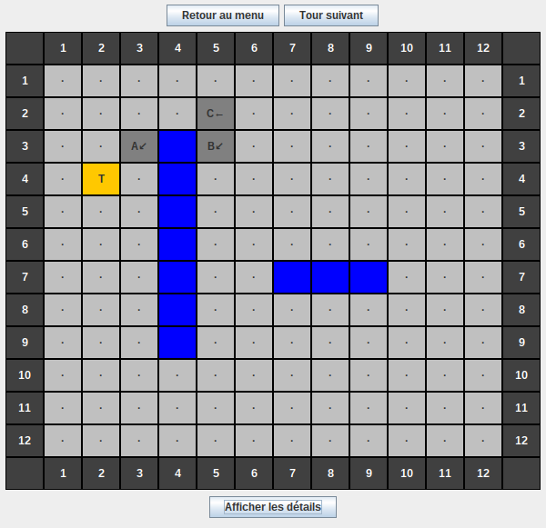
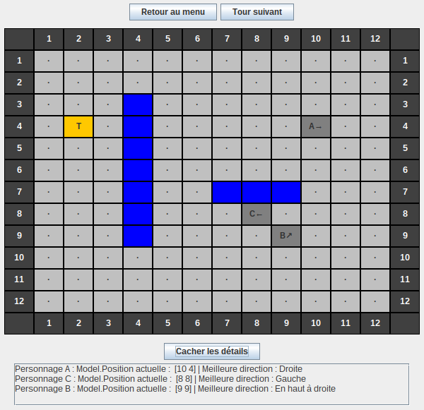

Treasure-chase
=============

Par [Nathanaël Houn](https://github.com/nathanaelhoun).

# Présentation



L'application est un jeu de chasse au Trésor dans laquelle des personnages autonomes se déplacent sur le terrain pour accéder à un trésor, contournant les murs et les autres obstacles possibles. 
Vous pouvez télécharger la dernière version du jeu depuis la [page des _releases_](https://github.com/nathanaelhoun/treasure-chase/releases). 
N'hésitez pas à [créer une _issue_](https://github.com/nathanaelhoun/Treasure-chase/issues/new) si vous trouvez un bug.

## Fonctionnalités

* Création d'un menu qui permet d'accéder aux différentes parties.

  

- Création d'un damier préfabriqué n°1, conforme à celui de l'énoncé.

  

- Création de damiers personnalisés via l'éditeur graphique, supportant le glisser-déposer pour plus de facililité d'utilisation. On peut supprimer une case qui a été posée en cliquant dessus. L'éditeur vérifie la validité du terrain avant de lancer la partie.

  

- Déplacement autonome des joueurs sur le terrain, qui ne peuvent rester coincés (notamment avec un algorithme spécialisé pour les sortir des coins, qui fait tourner le personnage jusqu'à qu'il ne soit plus face à un mur).

# Conception de l'application


Le diagramme de classe ci-dessus présente la structure utilisée du _package_ model, correspondant au modèle de la structure MVC.

## Changements par rapport au diagramme de classe initial

- Board a un attribut `treasure` qui permet d'accéder facilement au trésor,
- Board a une méthode `doRound()` qui appelle le `process()` pour chaque Hunter,
- Direction voit tous ses attributs renommés selon les points cardinaux pour une meilleure lisibilité,
- Direction gagne quatre fonctions statiques utilitaires : `getRandom()`, `rotate()`, `getCardinalPoints` et `reverse()`,
- Hunter possède une case courante `currentCell` plutôt qu'une position courante : la position courante est accessible depuis la case courante, et ainsi on peut libérer la case courante depuis le Hunter lors du `process()` ,
- Hunter gagne une fonction `getWantedPosition()`,
- Les attributs de Cell sont maintenant en protected,
- Cell gagne un attribut `treasure` qui contient une référence vers le trésor du Board,
- Les classes héritées de Cell ont été complètement réécrites :
	* Pour `CellFree` : le calcul de la meilleure direction vers le trésor est fait lors du premier appel à `process()`. Elle est ensuite stockée pour ne pas avoir à être recalculée par la suite sur la même case,
	* Pour `CellStone`, la meilleure direction dépend de la position du joueur : elle est calculée lors du premier appel à `process()` depuis une position donnée. 
        Cette meilleure direction est ensuite stockée dans une `Hashmap<Position, Direction>` pour être ensuite redonnée directement sans avoir à la recalculer. 
        L'utilisation d'une `HashMap` permet d'accéder en temps constant à la direction souhaitée, quel que soit le nombre de directions déjà calculées. 
        Cela permet aussi de savoir instantanément que la direction n'a pas encore été calculée, sans avoir à parcourir toutes les valeurs.
- De nombreuses méthodes ont été rajoutées dans Board pour la gestion de l'éditeur graphique, permettant à l'éditeur graphique de modifier les attributs du Board.

## Implémentation de `process()` pour chaque type de cellule

- Pour `CellFree`, la meilleure direction vers le trésor étant toujours la même, elle est calculée à l'initialisation du Board. 
`CellFree.process()` consiste donc uniquement à donner cette direction au Hunter,

- Pour `CellStone`, la meilleure direction à prendre pour contourner le mur dépend de l'emplacement du joueur. 
Elle est donc calculée à l'exécution, quand le joueur rencontre la pierre.


Tous les `process()` sont appelés par le `Board` à chaque tour dans `doRound()`. 
La méthode `doRound` renvoie une `HashMap<Position, Position>`, afin d'avoir tous les déplacements qui ont été effectués pendant le tour, utilisés pendant la mise à jour du plateau graphique (afin d'éviter de mettre à jour tout le terrain à chaque tour). 
L'utilisation d'une `HashMap` permet d'avoir accès aux couples de valeurs <ancienne position, nouvelle position>, rassemblée dans une `Map.Entry`.

## Choix des structures de données

Deux structures de données principales ont été utilisées dans ce projet :
- les `Java.util.ArrayList`, notamment sous forme d'`ArrayList<ArrayList<>>` pour les cases dans `Board` et pour les labels correspondant dans `GameWindow`. 
- les `Java.util.HashMap`, utilisées pour stocker des couples clés => valeurs (comme pour stocker les déplacements effectués lors de `doRound()` ou les meilleures directions en fonction de la position dans `CellStone`).

# Développement de l'application

## Fonctionnalités implantées (et testées)

- Menu qui permet d'accéder aux différentes parties.
- Board par défaut n°1, conforme à celui de l'énoncé.
- 4 types de case :
	* `CellSide` formant les bords du terrain. Elles renvoient dans la direction symétrique par rapport au joueur,
	* `CellTreasure`, représentant le trésor qui est à la case à atteindre. Unique sur chaque terrain,
	* `CellStone`, représentant un mur. Elle redirige vers le bord du mur le plus propice à se rapprocher du trésor,
	* `CellFree`, les cases sur lesquelles se déplacent les joueurs. Elles redirigent vers le trésor, sans prendre en compte les obstacles.
- Éditeur graphique de Board, supportant le glisser-déposer pour plus de facililité d'utilisation. On peut supprimer une case qui a été posée en cliquant dessus. L'éditeur vérifie la validité du terrain avant de lancer la partie.
- Déplacement autonome des joueurs sur le terrain, qui ne peuvent rester coincés (notamment avec un algorithme spécialisé pour les sortir des coins, qui fait tourner le personnage jusqu'à qu'il ne soit plus face à un mur).

## Fonctionnalités abandonnées

- Génération aléatoire de terrain, abandonnée par manque d'idée concernant la réalisation. Le code a été nettoyé des méthodes liées à cette fonctionnalité.

## Outils utilisés et organisation du travail

Après avoir utilisé Eclipse pendant la première partie du projet, je suis passé sous IntellijIDEA, IDE de JetBrains entièrement compatible avec Eclipse, pendant le développement de la version graphique, car celui-ci proposait une gestion plus facile de la bibliothèque JSwing. 
J'ai aussi fait le menu principal en utillisant l'outil _GUI Designer_ d'IntellijIDEA, afin de découvrir cet outil, ayant déjà fait toutes les autres interfaces à la main.


Git a été l'outil de versionnage utilisé tout au long du projet, avec au début 3 branches : `master`, `version-console` et `version-graphique`. 
Avant le rendu de la version console, les modifications sur le modèle étaient faites dans la branche `version-console`, avant d'être amenées dans le `master` afin d'être réintégrées dans la branche `version-graphique`.
Ensuite, tout le code a été centralisé dans la branche principale `master` jusqu'à la fin du projet afin de gagner en temps et en simplicité.
Des branches temporaires ont été utilisées pour implémenter chacune des nouvelles fonctionnalités, pour pouvoir en faire plusieurs _commits_ avant de réintégrer les modifications dans le `master` en fusionnant dans un seul _commit_ afin de garder un historique Git propre.

J'ai utilisé une liste afin de suivre un développement logique dans les fonctionnalités, en me concentrant sur une fonctionnalité à la fois. 
Plutôt que de m'éparpiller dès que je trouvais un souci ou une amélioration possible qui sortait de la fonctionnalité que je travaillais actuellement, je le rajoutais dans ma liste de tâches via un commentaire `// TODO` dans le code, ce qui m'a permis de ne rien oublier.

# Conclusion

Le travail en monôme n'était pas facile, car quand j'étais bloqué par manque d'idée, je n'avais pas quelqu'un qui pouvait me débloquer. 
De même, il n'était pas facile de faire tous les tests seuls : j'ai d'ailleurs partagé mon exécutable à des camarades pendant le développement pour rechercher les bugs que je n'avais pas testé, et cela a été très efficace.

La connaissance et la maitrise d'outils comme Git (que je maitrisais déjà) et Eclipse et IntellijIDEA (que je découvrais) ont été un vrai plus : à la fin du projet, j'avançais beaucoup plus rapidement, même si les tâches étaient plus complexes. 
Avoir un IDE entier permettait de faire des modifications importantes sur le code (comme de la refactorisation), tout en sachant que Git me permettait de garder le code fonctionnel précédent en cas de souci.

On peut imaginer encore beaucoup d'extensions à ce jeu : une amélioration de l'algorithme de recherche de chemin (qui est pour l'instant très basique), l'ajout d'autres types de cases.

# Annexes


------

Code Java de `GameController` pour initialiser les  `JLabels` de la vue à partir des `Cells` du modèle. On utilise une double boucle `for` pour parcourir les deux collections simultanément.

```java
// controller.GameController.java
public class GameController {
    // [...]
    public void initialiseCellLabels() {
        for (int y = 0; y < this.board.HEIGHT; y++) {
            for (int x = 0; x < this.board.WIDTH; x++) {

                JLabel labelToUpdate = this.window.getCellLabel(x, y);
                Cell cell = this.board.getCell(x + 1, y + 1);

                switch (cell.toString()) {
                    case "·":
                        labelToUpdate.setBackground(Color.LIGHT_GRAY);
                        labelToUpdate.setText("·");
                        break;

                    case "#":
                        labelToUpdate.setBackground(Color.BLUE);
                        break;

                    case "T":
                        labelToUpdate.setBackground(Color.ORANGE);
                        labelToUpdate.setText("T");
                        break;

                    default:
                        labelToUpdate.setBackground(Color.GRAY);
                        labelToUpdate.setText(cell.toString());
                }
            }
        }
    }
    // [...]
}
```

------

Code Java de `CellStone` permettant de trouver s'il vaut mieux contourner le mur par la gauche ou par la droite (pour un mur horizontal). Pour cela, on calcule la distance entre la position actuelle et l'extrémité gauche, plus la distance entre l'extrémité gauche et le trésor. On compare avec la droite, et on prend la plus courte des deux. Le calcul est similaire pour un mur vertical.

```java
// model.CellStone.java
public class CellStone {
    // [...]
    public void process(Hunter h) {
        // [...]
            
        Direction newDirection;
        switch (this.wallOrientation) {
            case HORIZONTAL:
                Cell wallWest = findWestEndOfTheWall();
                Cell wallEast = findEastEndOfTheWall();

                int distanceByWest = wallWest.distanceWith(hunterPosition)
                        + wallWest.distanceWith(this.treasure);
                int distanceByEast = wallEast.distanceWith(hunterPosition)
                        + wallEast.distanceWith(this.treasure);
    
                newDirection = Direction.WEST;
                if (distanceByWest > distanceByEast) {
                    newDirection = Direction.EAST;
                }
                break;
    
            // case VERTICAL identique [...]
        }
    
        this.bestDirections.put(hunterPosition, newDirection);
        h.setDirection(newDirection);
    }
    // [...]
}
```
