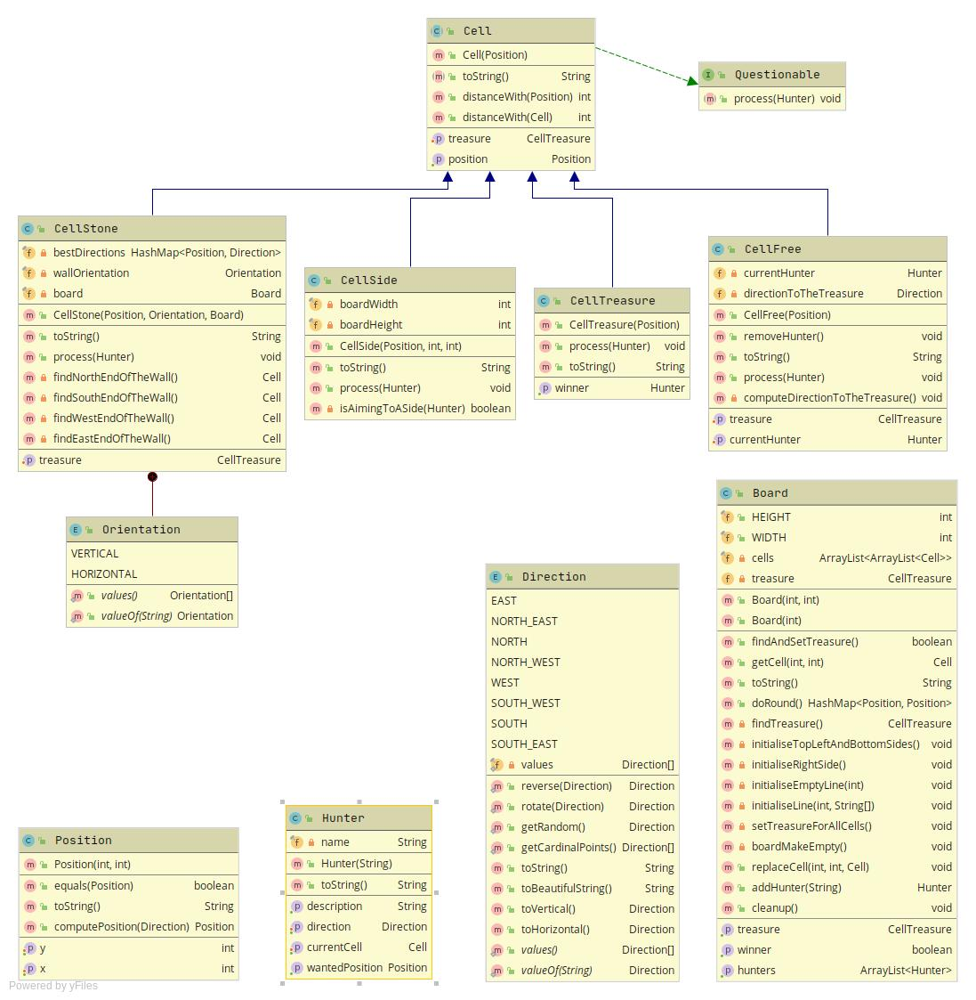

# Treasure-chase

Par [Nathanaël Houn](mailto:contact@nathanaelhoun.fr), Licence 2 Informatique à l'UFR-ST de Besançon 

## Présentation

L'application est un jeu de chasse au Trésor dans laquelle des personnages autonomes se déplacent sur le terrain pour accéder à un trésor, contournant les murs et les autres obstacles possibles.

## Conception de l'application

Le diagramme de classe ci-dessus présente la structure utilisée du _package_ model, correspondant au modèle de la structure MVC.

### Changements par rapport au diagramme de classe initial

* Board a un attribut `treasure` qui permet d'accéder facilement au trésor

* Board a une méthode `doRound()` qui appelle le `process()` pour chaque Hunter

- Direction voit tous ses attributs renommés selon les points cardinaux pour une meilleure lisibilité
- Direction gagne trois fonctions statiques utilitaires : `getRandom()`, `rotate()` et `reverse()`
- Hunter possède une case courante `currentCell` plutôt qu'une position courante : la position courante est accessible depuis la case courante, et ainsi on peut libérer la case courante depuis le Hunter lors du `process()` 
- Hunter gagne une fonction `getWantedPosition()`
- Les attributs de Cell sont maintenant en protected
- Cell gagne un attribut `treasure` qui contient une référence vers le trésor du Board
- Les classes héritées de Cell ont été complètement réécrites, notamment pour contenir les directions pour les Hunters, calculées à l'initialisation du Board plutôt qu'à l'exécution du programme (sauf pour CellStone, pour laquelle la direction est toujours calculée à l'éxecution)
- De nombreuses méthodes ont été rajoutées dans Board pour la gestion de l'éditeur graphique, permettant à l'éditeur graphique de modifier les attributs du Board

### Implémentation de `process()` pour chaque type de cellule

Pour `CellFree`, la meilleure direction vers le trésor étant toujours la même, elle est calculée à l'initialisation du Board. `CellFree.process()` consiste donc uniquement à donner cette direction au Hunter

Pour `CellStone`, la meilleure direction à prendre pour contourner le mur dépend de l'emplacement du joueur. Elle est donc calculée à l'exécution, quand le joueur rencontre la pierre.

TODO : choix justifié de structures de données, éventuels algorithmes intéressants

## Développement de l'application

TODO : Captures d'écran pour les points intéressant du programme

### Fonctionnalités implantées (et testées)

- Création d'un Board par défaut n°1, conforme à celui de l'énoncé.
- Création de Board personnalisés via l'éditeur graphique, supportant le glisser-déposer pour plus de facililité d'utilisation. Cet éditeur ne permet pas encore d'ajouter des murs. L'éditeur vérifie la validité du terrain avant de lancer la partie.
- Déplacement autonome des joueurs sur le terrain, qui ne peuvent rester coincés (notamment avec un algorithme spécialisé pour les sortir des coins)

### Fonctionnalités abandonnées

- Génération aléatoire de terrain, abandonnée par manque d'idée concernant la réalisation

### Outils utilisés et organisation du travail

Après avoir utilisé Eclipse pendant la première partie du projet, je suis passé sous IntelliJ IDEA, IDE de JetBrains entièrement compatible avec Eclipse, pendant le développement de la version graphique, car celui-ci proposait une gestion plus facile de la bibliothèque JSwing. 

Git a été l'outil de versionnage utilisé tout au long du projet, avec au début 3 branches : `master`, `version-console` et `version-graphique`. Avant le rendu de la version console, les modifications sur le modèle étaient faites dans la branche `version-console`, avant d'être amenées dans le `master` afin d'être réintégrées dans la branche `version-graphique`. Ensuite, tout le code a été centralisé dans la branche principale `master` jusqu'à la fin du projet afin de gagner en temps et en simplicité.

J'ai utilisé une liste afin de suivre un développement logique dans les fonctionnalités, en me concentrant sur une fonctionnalité à la fois. Plutôt que de m'éparpiller dès que je trouvais un souci ou une amélioration possible qui sortait de la fonctionnalité que je travaillais actuellement, je le rajoutais dans ma liste de tâches via un commentaire `// TODO` dans le code, ce qui m'a permis de ne rien oublier au final.

## Conclusion

Bilan par rapport au travail en monôme, par rapport à la formation

## Annexes

Autres captures d'écran, codes java intéressants

## À garder en tête pour la mise en forme

- Numéroter les pages
- Présentation aérée
- Figures titrées et légendées
- Présenter les points de conceptions importants de l'application
